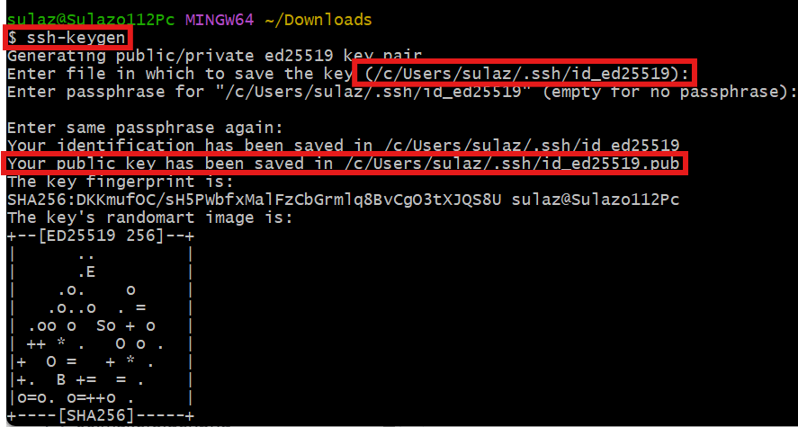
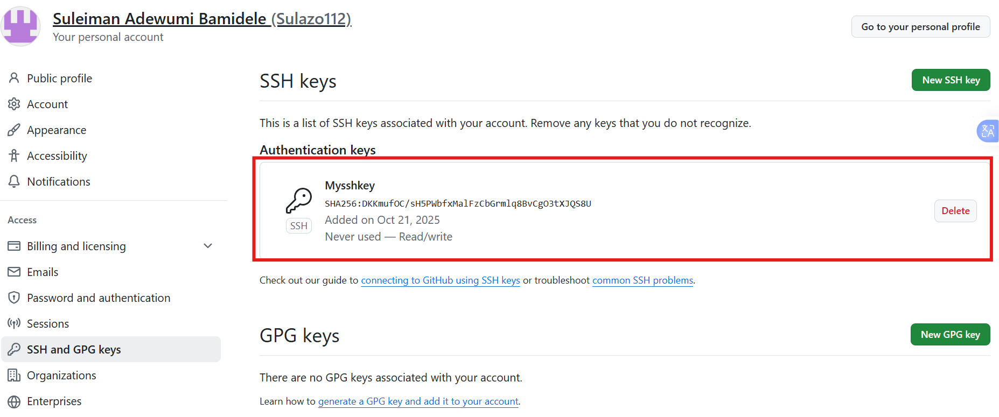

# Capstone Project: E-Commerce Platform Deployment with Git, Linux, and AWS

### Scenario

We have been assigned to develop an e-commerce website for a new online marketplace named "MarketPeak." This platform will feature product listings, a shopping cart, and user authentication. our objective is to utilize Git for version control, develop the platform in a Linux environment, and deploy it on an AWS EC2 instance. We can find a suitable website template (https://www.tooplate.com/) to kickstart our development.

## Tasks

## 1. Implement Version Control with Git

1.1. Initialize Git Repository

Begin by creating a project directory named "MarketPeak_Ecommerce"

Inside this directory, initialize a Git repository to manage your version control.

1.2. Obtain and Prepare the E-Commerce Website Template

Instead of developing the website from scratch, we'll use a pre-existing e-commerce website template. This approach allows us to focus on the deployment and operational aspects, rather than on web development. The actual web development is done by web/software developers on the project.

Download a Website Template: Visit Tooplate or any other free template resource, and download a suitable e-commerce website template. Lets look for templates that are ready to use and require minimal adjustments from: https://www.tooplate.com

It is recommended you download the specific template https://www.tooplate.com/view/2114-pixie

Prepare the Website Template: Extract the downloaded template into our project directory, MarketPeak_Ecommerce.

Customize the Template (Optional): If desired and you have basic web development skills, you can make minor customizations to the template to tailor it to "MarketPeak" This might include updating logos, changing color schemes, or modifying text to better fit the marketplace's brand identity.

1.3. Stage and Commit the Template to Git

Add your website files to the Git repository.

Set your Git global configuration with your username and email.

Commit your changes with a clear, descriptive message.

1.4 Lets Push the code to our Github repository

After initializing our Git repository and adding our e-commerce website template, the next step is to push our code to a remote repository on GitHub. This step is crucial for version control and collaboration.

Create a Remote Repository on GitHub: Log into your GitHub account and create a new repository named "MarketPeak_Ecommerce" Leave the repository empty without initializing it with a README, .gitignore, or license.

Link Your Local Repository to GitHub: In our terminal, within our project directory, add the remote repository URL to our local repository configuration.

git remote add origin https://github.com/Sulazo112/MarketPeak_Ecommerce.git

Note: Make sure you replace "your-git-username" with your actual git username

Push our Code: Upload your local repository content to GitHub.

git push -u origin master

This command pushes your commits from your local main branch to the remote repository on GitHub, enabling you to store your project in the cloud and share it with others.

# 2. AWS Deployment

To deploy "MarketPeak_Ecommerce" platform, you'll start by setting up an Amazon EC2 instance:

2.1. Set Up an AWS EC2 Instance

Log in to the AWS Management Console.

Launch an EC2 instance using an Amazon Linux AMI.

Connect to the instance using SSH.

2.2. Clone the repository to the Linux Server

Before deploying our e-commerce platform, you need to clone the GitHub repository to our AWS EC2 instance. This process involves authenticating with GitHub and choosing between two primary methods of cloning a repository: SSH and HTTPS. To see the ssh or http link to clone your repository

Navigate to your repository in github console

Select the code as highlighted in the image below.

SSH Method:

On our EC2 instance, lets generate SSH keypair using ssh-keygen.

ssh-keygen

Display and Copy your public key

cat /c/Users/sulaz/.ssh/id_ed25519.pub

Note: Your ssh public key will different

Add the SSH public key to your GitHub account.

Use the SSH clone URL to clone the repository:

git clone git@github.com:Sulazo112/MarketPeak_Ecommerce.git

HTTPS Method:

For repositories that you plan to clone without setting up SSH keys, use the HTTPS URL. GitHub will prompt for your username and password:

git clone https://github.com/Sulazo112/MarketPeak_Ecommerce.git

2.3. Install a Web Server on EC2

Apache HTTP Server (httpd) is a widely used web server that serves HTML files and content over the internet. Installing it on Linux EC2 server allows you to host MarketPeak E-commerce site:

Install Apache web server on the EC2 instance. Note that httpd is the software name for Apache on systems using yum package manager

sudo yum update -y

sudo yum install httpd -y

sudo systemctl start httpd

sudo systemctl enable httpd

sudo systemctl status httpd

This first updates the linux server and then installs httpd (Apache), starts the web server, and ensures it automatically starts on server boot.

2.4. Configure httpd for Website

To serve the website from the EC2 instance, lets configure httpd to point to the directory on the Linux server where the website code files are stored. Usually in /var/www/html

Prepare the Web Directory: Clear the default httpd web directory and copy MarketPeak Ecommerce website files to it.

